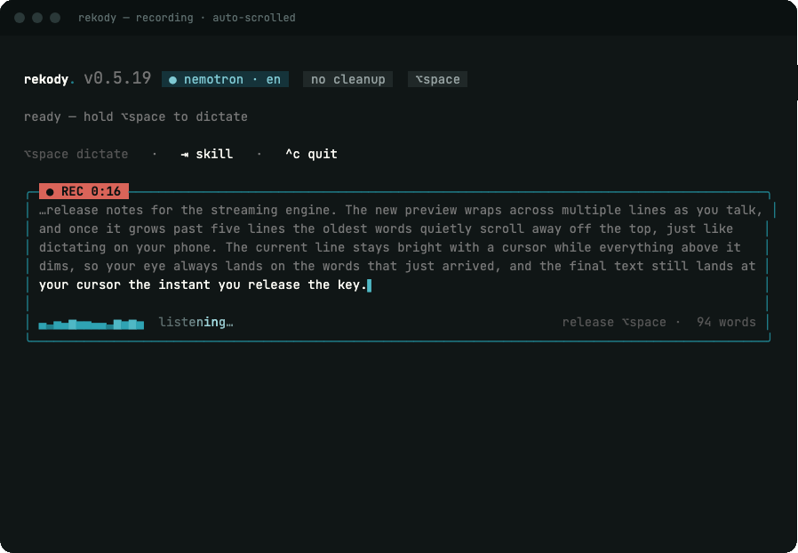
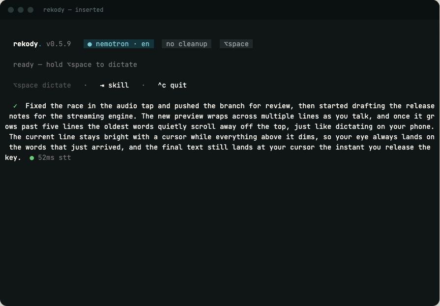
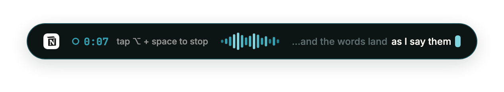

<p align="center">
  
</p>

<h1 align="center">rekody</h1>

<p align="center"><strong>/ˈrɛ.kə.di/</strong> — record + melody, the rhythm of your voice becoming text.</p>

<p align="center">
  <a href="https://github.com/rekody/rekody/releases/latest"></a>
  <a href="https://github.com/rekody/rekody/actions/workflows/ci.yml"></a>
  <a href="LICENSE"></a>
  <a href="https://github.com/rekody/rekody/releases/latest"></a>
  <a href="https://github.com/rekody/homebrew-rekody"></a>
  <a href="https://huggingface.co/Rekody"></a>
</p>

**Open-source, privacy-first voice dictation for the terminal.**

Hold `⌥Space`, speak, release. Your words appear at the cursor — anywhere on your desktop.

<p align="center">
  <a href="docs/assets/demo.mp4">
    
  </a>
</p>

<p align="center"><a href="docs/assets/demo.mp4"><strong>▶ Watch the 30-second film with sound</strong></a></p>

**New: streaming dictation.** With the on-device Nemotron engine, rekody transcribes *while you talk* — the live console shows your words as you speak, and the final text lands at your cursor **~50ms after you release the key** (batch engines take 1–3s).

<p align="center">
  
</p>

---

## Quick Start

```bash
# Install via Homebrew (recommended) — auto-taps + installs
brew install rekody/rekody/rekody
# Newer Homebrew versions gate third-party taps — if prompted, run:
#   brew trust rekody/rekody

# Or one-line installer (no Homebrew needed)
curl -fsSL https://raw.githubusercontent.com/rekody/rekody/main/install.sh | bash

# Or build from source
git clone https://github.com/rekody/rekody.git
cd rekody
make install

# First run launches the setup wizard
rekody
```

**Requirements:** macOS (Apple Silicon or Intel).

```bash
# Update
brew upgrade rekody
# or
rekody update
```

---

## Usage

```
rekody [COMMAND]

Commands:
  (none)   Run voice dictation
  setup    Re-run first-time setup / reconfigure
  config   Show or edit current configuration
  history  Browse dictation history
  doctor   Test STT and LLM provider connectivity
  key      Manage API keys in the system keychain
  skill      Pick the active dictation skill (email, notes, commit, ...)
  dictionary Manage custom vocabulary (instant corrections for your terms)
  fix        Correct the transcript of a recent dictation (trains your dataset)
  update     Update to the latest release

Options:
  -v, --verbose    Enable debug tracing
  -h, --help       Print help
  -V, --version    Print version
```

### Skills

A **skill** reshapes your dictation via the LLM into a specific form — a
professional email, bulleted notes, a commit message, a spec, and more.
Skills are Markdown files in `~/.config/rekody/skills/`; rekody ships a
starter pack and you can add your own.

```
rekody skill              # interactive picker (sticky — stays until changed)
rekody skill list         # list available skills
rekody skill use email    # activate a skill by name
rekody skill none         # clear the active skill (back to per-app auto-detect)
```

**Switch skills without leaving your app:** while dictating, hold `⌥Space` and
tap `Tab` to cycle the active skill (`Auto → email → notes → … → Auto`). The
new skill is named in the status line and applies to your next dictation — no
need to stop or restart rekody.

A skill file is frontmatter + a prompt body that becomes the LLM system
prompt:

```markdown
---
name: email
description: Professional email — greeting, body, sign-off
triggers: Mail, Spark, Superhuman    # optional: auto-apply when these apps are focused
inherit_base: false                  # optional: prepend the strict cleanup rules
---
You turn a raw voice transcription into a professional email.
- Open with a greeting only if a recipient was named.
- Organize the body into clear paragraphs.
```

Precedence: an explicitly selected skill wins; otherwise a skill whose
`triggers` match the focused app applies; otherwise the built-in per-app
prompt is used. **Skills require LLM post-processing** — if no LLM provider is
configured (or `llm_enabled = false`), the selected skill has no effect.

### Custom vocabulary

If your jargon, names, or product terms come out with the wrong casing or a
near-miss spelling (e.g. "recody" for "rekody"), add them to your personal
dictionary. A deterministic pass fixes casing and near-misses of your terms on
every dictation, on every engine, with no AI in the loop. When AI cleanup is
enabled, your terms are also listed in the cleanup prompt so the model
preserves them.

```bash
rekody dictionary add rekody       # multi-word is fine, no quotes: add Core ML
rekody dictionary list
rekody dictionary remove rekody
```

Stored at `~/.config/rekody/dictionary.toml`. Honest limits: the corrector
fixes near-misses ("recody"), not mishears where the engine heard a different
real word ("recording" for "rekody"). Fixing those at the source, by biasing
the engines themselves with your terms, is in progress: [#88](https://github.com/rekody/rekody/issues/88)
(local Whisper), [#89](https://github.com/rekody/rekody/issues/89) (Deepgram),
[#90](https://github.com/rekody/rekody/issues/90) (Groq),
[#91](https://github.com/rekody/rekody/issues/91) (Rekody Streaming).

### Hotkey

| Mode | Shortcut | Behaviour |
|------|----------|-----------|
| **Push-to-talk** (default) | `⌥Space` | Hold to record, release to transcribe |
| **Toggle** | `⌥Space` | Tap to start, tap again to stop |
| **Cycle skill** | `⌥Space`+`Tab` | Hold ⌥Space, tap Tab to switch the active skill |

> **macOS:** rekody uses an active `CGEventTap` so `⌥Space` is fully suppressed — it will not insert a non-breaking space into your focused window. Requires **Accessibility** permission (System Settings → Privacy & Security → Accessibility).

### macOS permissions

rekody needs two TCC permissions:

| Permission | Why | Granted to |
|------------|-----|------------|
| **Accessibility** | Suppress `⌥Space` before it reaches the focused app (so it doesn't type a non-breaking space) | `rekody` binary |
| **Microphone** | Capture audio for transcription | **Your terminal** (see below) |

> **Why "Terminal.app" (or iTerm / Warp / Ghostty) shows up in your Microphone list instead of rekody:** macOS TCC attributes microphone access to the *responsible process* of a CLI app, which for terminal-launched binaries is the parent terminal emulator — not rekody itself. This is a system-level design, not a bug. The permission granted to your terminal applies to every command you run inside it, including rekody.
>
> If you've granted microphone access to your terminal once, rekody will work. If the permission is missing or denied, `rekody setup` will prompt for it eagerly; `rekody doctor` probes the device and shows the current state.

### Configuration

```bash
rekody config          # show current config
rekody config edit     # open config.toml in $EDITOR
rekody config path     # print config file location
```

Config file lives at `~/.config/rekody/config.toml`.

**All options:**

```toml
activation_mode = "push_to_talk"   # "push_to_talk" | "toggle"
injection_method = "clipboard"     # "clipboard" | "native"
vad_threshold = 0.01               # RMS energy threshold (0.005–0.05)
whisper_model = "tiny"             # "tiny" | "small" | "medium" | "turbo" | "large"

# STT engine
stt_engine = "deepgram"            # "local" | "deepgram" | "groq" | "cohere"
deepgram_api_key = "dg_..."        # required when stt_engine = "deepgram"

# LLM post-processing (omit or set false to disable)
# Auto-disabled when stt_engine = "deepgram" (smart_format handles cleanup)
llm_enabled = false                # true | false | omit for auto

# LLM providers — tried in order, first success wins
[[providers]]
name = "groq"
api_key = "gsk_..."
model = "openai/gpt-oss-20b"

[[providers]]
name = "ollama"            # local fallback, no key needed
model = "llama3.2:3b"
```

### API Keys

Keys are stored in the macOS Keychain — never in plaintext on disk.

```bash
rekody key set deepgram     # securely prompt + save
rekody key set groq
rekody key list             # show which keys are stored
rekody key delete groq      # remove a key
```

### The live console

While you dictate, the terminal shows a live card: your words stream in as
you speak (older lines scroll away like a phone dictation sheet), with a
real-time waveform, timer, and the active skill. Completed dictations stack
above it with their latency.

<p align="center">
  
</p>

### Your personal fine-tuning dataset

Every dictation can save its audio (lossless FLAC, ~60MB per hour of speech)
plus transcript locally to `~/.local/share/rekody/training-data/` — so when
you want a model fine-tuned on *your* voice, the dataset is already waiting.
On by default with an explicit consent prompt in setup; `save_training_data
= false` turns it off; `rekody doctor` shows size; **nothing ever leaves
your machine.**

Misheard something? Fix the label while you still remember what you said:

```bash
rekody fix            # shows what was heard, prompts for the correction
rekody fix --play     # replay the clip first
rekody fix -n 2       # reach back two dictations
```

### Desktop HUD (preview)

A native floating pill for people who don't live in the terminal — it
appears while you dictate (timer, live waveform, streaming words) and
vanishes when you're done. Hidden from screen shares by default.

<p align="center">
  
</p>

The open-source daemon already ships the HUD integration (`docs/design/hud-protocol.md`);
the pill itself is in private preview and will be distributed separately.

### History

```bash
rekody history                    # last 20 dictations
rekody history -c 50              # last 50
rekody history -s "bug fix"       # search by text
rekody history -a "VS Code"       # filter by app
rekody history --full             # show full text + raw transcript
rekody history --stats            # usage statistics + top apps
rekody history --json             # raw JSON output (pipe-friendly)
rekody history --copy 1           # copy latest entry to clipboard
rekody history --copy 3           # copy 3rd-most-recent to clipboard
```

History is stored at `~/.config/rekody/history.json` (up to 5,000 entries).

### Doctor

```bash
rekody doctor    # live connectivity check for all configured providers
```

---

## STT Engines

| Engine | Quality | Release→text | Notes |
|--------|---------|--------------|-------|
| `nemotron` | ★★★★☆ | **~50ms** | **Streaming** — transcribes while you talk, fully on-device (NVIDIA Nemotron, int8). English. Apple Silicon |
| `local` | ★★★★☆ | 1–3s | whisper.cpp turbo + Core ML, 100+ languages, offline |
| `deepgram` | ★★★★★ | ~200ms | Nova-3, smart formatting, cloud |
| `groq` | ★★★★☆ | ~300ms | Whisper Large v3, cloud |
| `cohere` | ★★★★☆ | varies | Local server on configurable port |

**Recommended:** `nemotron` for English (the setup default — nothing leaves your Mac and the text is ready the instant you release the key). `local` Whisper for multilingual dictation.

---

## LLM Providers

LLM post-processing cleans filler words, fixes grammar, and adapts formatting to the active app (code editor, chat, email, etc.). **Automatically disabled when using Deepgram** since it already formats output.

| Provider | Type | Default model |
|----------|------|---------------|
| `apple` | **On-device** | Apple Intelligence (macOS 26+) — zero download, no key |
| `groq` | Cloud | `openai/gpt-oss-20b` |
| `cerebras` | Cloud | `llama3.1-8b` |
| `together` | Cloud | `meta-llama/Meta-Llama-3.1-8B-Instruct-Turbo` |
| `openrouter` | Cloud | `llama-3.1-8b-instruct:free` |
| `fireworks` | Cloud | user's choice |
| `openai` | Cloud | `gpt-4o-mini` |
| `anthropic` | Cloud | `claude-sonnet-4-20250514` |
| `gemini` | Cloud | `gemini-2.0-flash` |
| `ollama` | Local | `llama3.2:3b` |
| `lm-studio` | Local | loaded model |
| `vllm` | Local | user's choice |
| `custom` | Any | user's choice |

Multiple providers fall back automatically: first success wins.

### On-device cleanup (Apple Foundation Models)

On **macOS 26+** with Apple Intelligence enabled, rekody can clean up dictation
using Apple's built-in on-device LLM — **no download, no API key, fully private,
~0.5s** per cleanup. It's a great default that needs no cloud account.

It runs through a small Swift helper (`rekody-fm`). On Apple Silicon it ships
**bundled in the Homebrew release** (installed alongside `rekody`), so most
users just:

```bash
rekody setup            # choose "Apple on-device" as the LLM provider
rekody doctor           # confirms "Apple on-device — Foundation Models ready"
```

Building from source instead? Install the helper once with `make fm-helper`
(builds it to `~/.local/share/rekody/bin`).

If the helper is missing or Apple Intelligence is off, rekody falls through to
your other configured providers (or the raw transcript) — it never breaks
dictation.

---

## Architecture

```
⌥Space ──▶ CGEventTap ──▶ AudioCapture ──▶ VAD ──▶ STT ──▶ LLM (optional) ──▶ Inject
           (suppresses     cpal/rubato    RMS    Deepgram/  provider chain   clipboard/
            key event)     16kHz mono     based  Whisper/   with failover    CGEvent)
                                                 Local
```

```
rekody/
├── crates/
│   ├── rekody-core      Pipeline orchestrator, config, onboarding, context detection
│   ├── rekody-audio     Microphone capture, resampling, energy-based VAD
│   ├── rekody-stt       Deepgram Nova-3, Groq Whisper, local whisper.cpp, Cohere
│   ├── rekody-llm       11 LLM providers + custom, automatic failover chain
│   ├── rekody-inject    Text injection: clipboard paste + native CGEvent/SendInput
│   └── rekody-hotkey    Global ⌥Space listener via CGEventTap (active, suppressing)
└── config/
    └── default.toml      Template configuration
```

---

## Security

- **Audio never leaves your machine** unless you choose a cloud STT engine.
- **LLM calls send only the transcript text** — never raw audio.
- **API keys stored in system keychain** (macOS Keychain) — not in config files or env vars.
- **Config file chmod 0600** — readable only by the owning user.
- **History file chmod 0600** — same protection.
- **Active event tap** suppresses `⌥Space` before it reaches other apps.
- **No telemetry, no analytics, no phone-home.**

---

## For AI Agents

rekody is designed to be easy for AI coding agents to install and configure:

```bash
# Point your agent at this file, then:
# "Install rekody and set it up with Deepgram"

# Quick machine-readable status
rekody doctor --json 2>/dev/null || rekody --version

# Non-interactive config update
rekody config path           # get config file path
# then edit ~/.config/rekody/config.toml directly

# Set a key non-interactively (via security CLI)
security add-generic-password -s "com.rekody.voice" -a "deepgram" -w "YOUR_KEY" -U

# Get history as JSON for downstream processing
rekody history --json -c 100

# Copy last transcript to clipboard
rekody history --copy 1
```

**SKILLS.md** contains a structured agent onboarding guide — point your agent at it:

> "Read SKILLS.md and set up rekody for voice dictation on this machine."

---

## Contributing

See [CONTRIBUTING.md](CONTRIBUTING.md) for development setup.

```bash
cargo build -p rekody-core --release    # build
cargo test                              # test
make install                            # build + install to /usr/local/bin
```

---

## License

[MIT](LICENSE)

---

## Star History

<a href="https://www.star-history.com/?repos=rekody%2Frekody&type=date&legend=top-left">
 <picture>
   <source media="(prefers-color-scheme: dark)" srcset="https://api.star-history.com/chart?repos=rekody/rekody&type=date&theme=dark&legend=top-left&sealed_token=gJJbxrk-Lb4iFsbhZF8paUmzWIlWqBHuF3xvMWeWxHao9Jn30VKqgH0sXdeYM57xUn8kCz8o_Vqs5OSGynU36aAgjsrZOeGp9sDcFViiX8gk82uNCLJVpA" />
   <source media="(prefers-color-scheme: light)" srcset="https://api.star-history.com/chart?repos=rekody/rekody&type=date&legend=top-left&sealed_token=gJJbxrk-Lb4iFsbhZF8paUmzWIlWqBHuF3xvMWeWxHao9Jn30VKqgH0sXdeYM57xUn8kCz8o_Vqs5OSGynU36aAgjsrZOeGp9sDcFViiX8gk82uNCLJVpA" />
   
 </picture>
</a>
